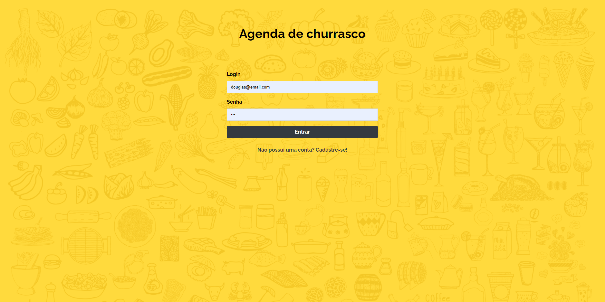
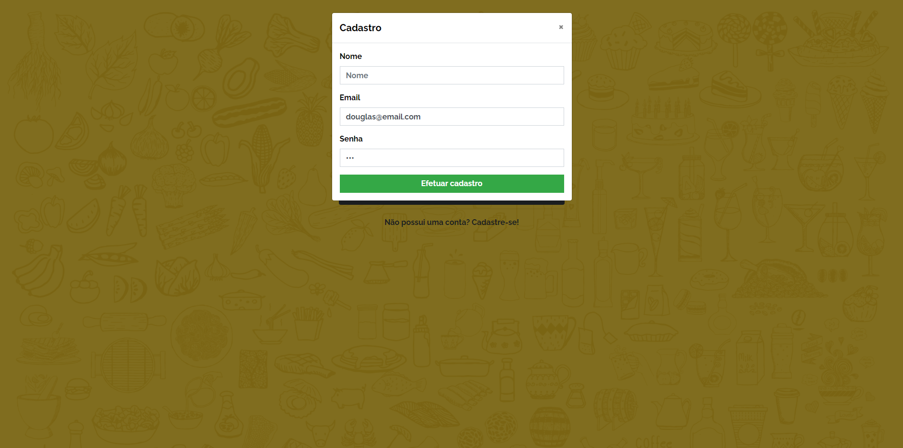
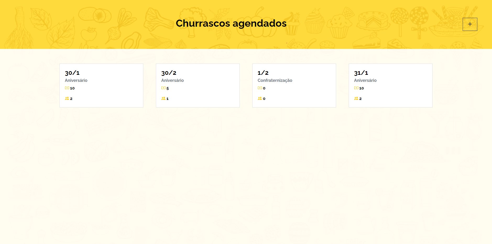
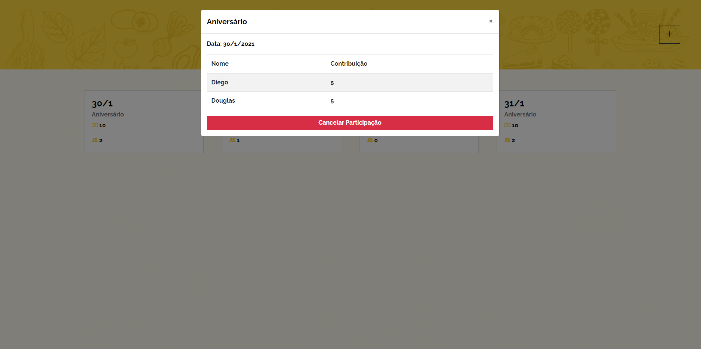
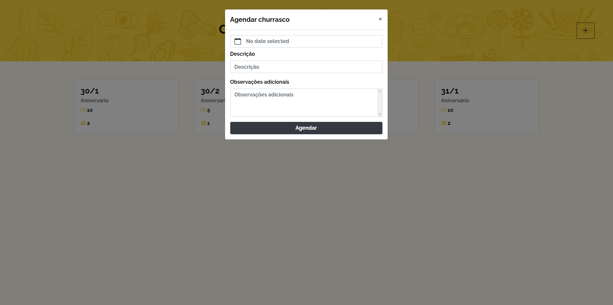

# Churras

## Requirements
- .NET Core 3.1
- Vue CLI 4.1.2

## Running

### Front 
```
npm install
npm run serve
```

### Api
```
dotnet restore
dotnet build
dotnet run
```
###### Obs: You may have to change the port in churras-front/src/config/env.js if you run from Visual Studio

### Demo






